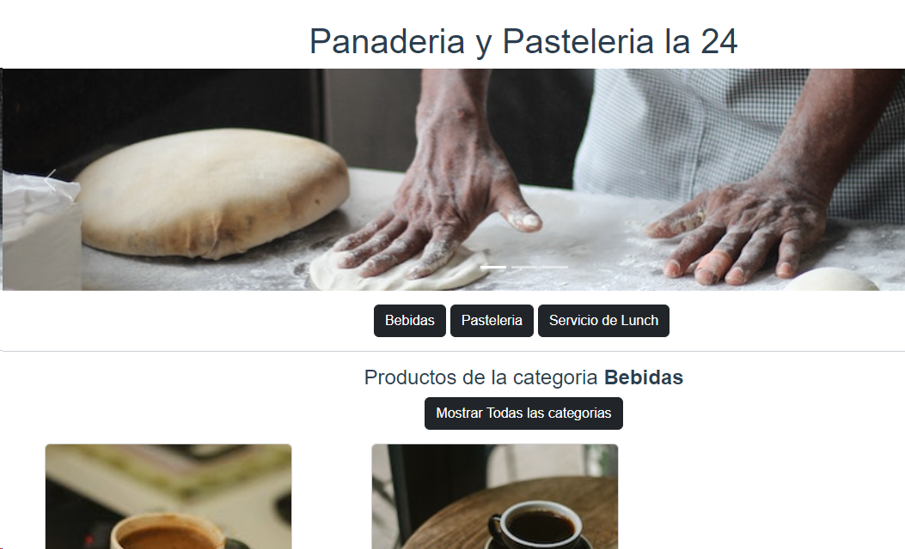
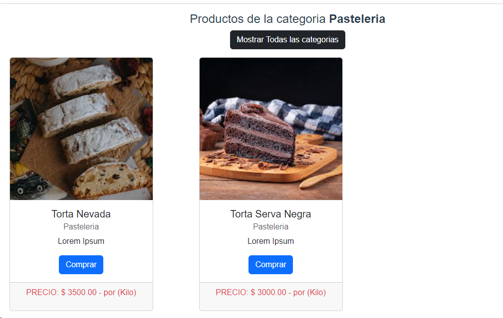

## Django App + VueJs

Aplicación Vue que consume APIs Creadeas en Django Rest Framwork

| BackEnd | FrontEnd | Repositorio de Datos |
|-|-|-|
| Django  | VueJs | SQLite3 |

---

Paqueteria Utilizada en Django

| Paquete | Versión |
|-|-| 
| Django | 4.2.7 |
| Pillow | 10.1.0 |
| coreapi | 2.3.3 |
| django-cors-headers | 4.3.0 |
| django-filter | 23.3 |
| djangorestframework | 3.14.0 |

Paqueteria Utilizada en Vue

| Paquete | Versión |
|-|-| 
| axios | ^1.6.0 |
| Vue | ^18.2.0 |

---

---

|Raúl Ibáñez M.|
|-------------------------|
